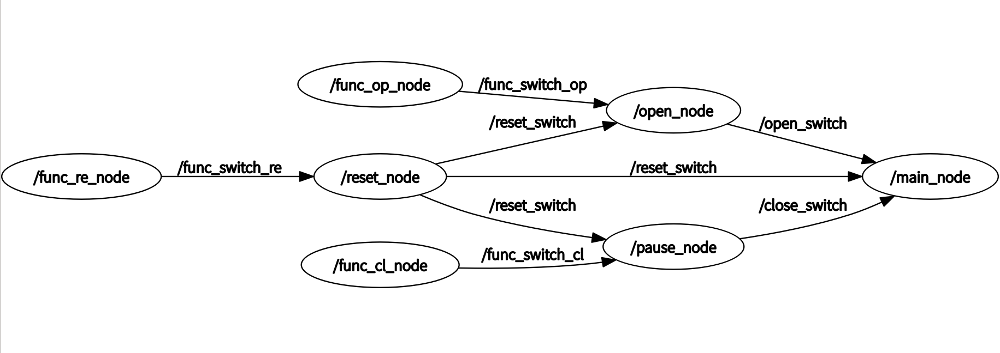

# xf_pyros_iat
基于ros的语音识别，使用python与科大讯飞语音听写api实现实时的语音识别，并利用节点发布话题控制进程。  
## 环境要求：  
* ros1，python3.x  
* 声卡：```sudo apt install libasound2-dev```
* requirement：  
    * pass
## 项目结构：
```
XF_PYROS_IAT
│  .gitattributes
│  CMakeLists.txt
│  package.xml
│  README.md
│
├─launch
│      main_node.launch
│
├─others
│      node.png
│      node_main.png
│
├─scripts
│      close_switch_node.py
│      main_node.py
│      open_switch_node.py
│      reset_node.py
│
└─src
        func_open_node.cpp
        func_pause_node.cpp
        func_reset_node.cpp
```
## 节点说明：  

* `main_node.py`是主程序，承担语音识别模块，对应节点为：`/main_node`，只运行该节点不会直接开始语音识别  
* `open_switch_node.py`用于开启主程序语音识别，对应节点为：`/open_node`  
* `close_switch_node.py`用于关闭主程序语音识别，对应节点为：`/pause_node`  
* `reset_node.py`用于重置整个进程，使其恢复到休眠状态，对应节点为：/reset_node，运行一次该节点后就可以通过open_switch_node.py或/open_node再次开启语音识别
* src中的cpp文件是用于生成ros节点，实际上就是用于控制以上节点，对应关系如下：（主要由于本人不会c++，故才加了src中的三个节点，如果你会C++可以自己把以上节点改写为C++）
  * _`func_open_node.cpp` --> `open_switch_node.py` 、`func_pause_node.cpp` --> `close_switch_node.py` 、`func_reset_node.cpp` --> `reset_node.py`_
## 使用步骤:  
***注意：请提前修改 main_node.py 中的科大讯飞APPID，APIKey，APISecret！***  
终端一：   
```
roslaunch xf_pyros_iat main_node.launch
```
终端二：  
* 发布话题`/func_switch_op`启动语音识别，`data: ' '`里可以是任何字符串，没有也行  
```
rostopic pub /func_switch_op std_msgs/String "data: ''" 
```
* 发布话题`/func_switch_cl`关闭语音识别，`data: ' '`里可以是任何字符串，没有也行  
```
rostopic pub /func_switch_cl std_msgs/String "data: ''" 
```
* 发布话题`/func_switch_re`重置语音识别，`data: ' '`里可以是任何字符串，没有也行  
```
rostopic pub /func_switch_re std_msgs/String "data: ''" 
```
* 此外通过`func_op_node`、`func_cl_node`、`func_re_node`三个节点也可以控制开、关、重置语音识别，命令如下：  
```
rosrun xf_pyros_iat func_op_node
```
```
rosrun xf_pyros_iat func_cl_node
```
```
rosrun xf_pyros_iat func_re_node
```
* 在终端一中查看语音识别情况，在终端二中使用节点或者发布话题来控制语音识别  
* 在[这里](https://github.com/Picaun/pyros_voice_identify "Picaun/pyros_voice_identify")可以找到更详细的配置步骤
